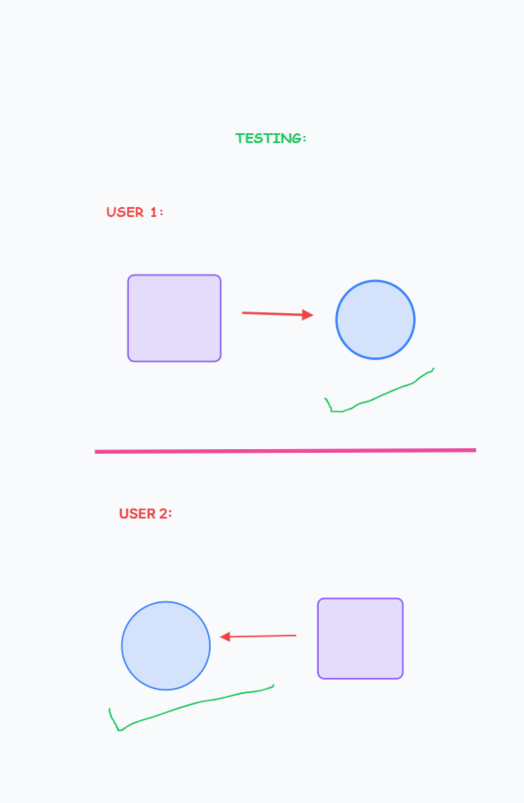
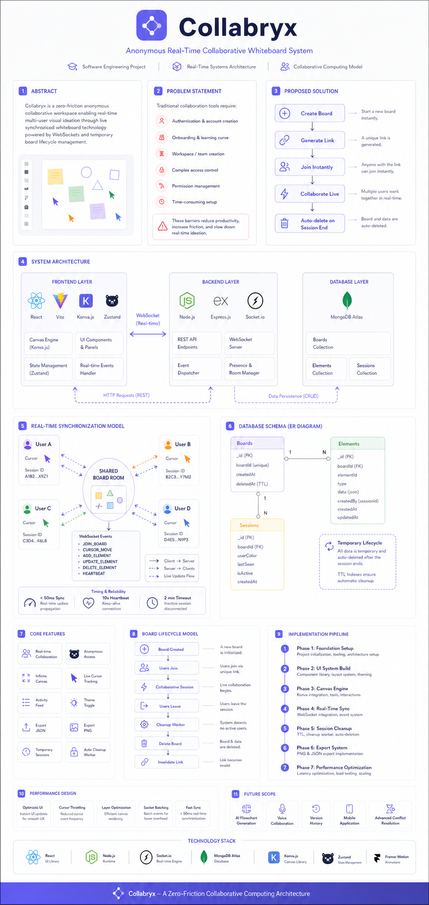

#  Collabryx — System Overview

Hey there! As the creator of Collabryx, I’m excited to share the "behind-the-scenes" of how this platform actually works. This document isn't just a technical spec—it's a story of how I built a high-speed, real-time collaboration engine from the ground up.

---

## 🌟 Introduction
I built **Collabryx** because I was tired of the "account wall." Most whiteboarding tools force you to sign up before you can even draw a single line. I wanted something that felt like a physical whiteboard in a meeting room: you walk in, pick up a marker, and start drawing.

Collabryx is a web-based, real-time canvas where you can brainstorm, sketch flowcharts, or leave sticky notes for your team. It’s anonymous, instant, and incredibly fast.

---

## 🎯 Objectives
The mission for this project was simple but challenging:
*   **Zero Friction**: No logins. Create a board in one click.
*   **Total Sync**: If you move a shape, I should see it move smoothly on my screen with zero perceived lag.
*   **Session-Based Privacy**: Data shouldn't clutter the cloud forever. When the meeting is done and everyone leaves, the board eventually clears itself.

---

## 🛠️ Methodology Used
I approached this using a **Modular Agile Methodology**. I didn't want to build a "monolith." Instead, I built the canvas engine first as a standalone "brain," then I built the real-time "nervous system" (WebSockets), and finally, I wrapped it in a beautiful, responsive UI.

I spent a lot of time on "Canvas-first" development. I tested how many elements I could draw before the frame rate dropped, and only when I was happy with the 60fps performance did I start adding the multi-user synchronization.

---

## 🚀 Technology Used
Here’s the tech that makes the magic happen:
*   **React & TypeScript**: The foundation. TypeScript helped me keep track of complex canvas element properties without making mistakes.
*   **Konva.js**: This is the secret sauce. It uses the HTML5 Canvas API to render shapes. Unlike SVG-based tools, Konva allows us to handle thousands of shapes smoothly.
*   **Socket.io**: This handles the "real-time" heartbeat. It pushes data between users in milliseconds.
*   **Node.js & Express**: The reliable backbone that manages board creation and API routing.
*   **Zustand**: My choice for state management. It’s incredibly fast and doesn't get in the way, which is vital when syncing cursor positions 60 times per second.
*   **MongoDB Atlas**: A cloud database that stores board states temporarily.

---

## ⚙️ Working of the System
How does it all come together? Here’s the step-by-step:
1.  **Landing**: You click "Create Board," and the backend generates a random, secure ID.
2.  **Connection**: Your browser connects to the server via a WebSocket. You are placed in a "Room" dedicated to your specific board ID.
3.  **Interaction**: You draw a line. The frontend captures those points, updates your local screen instantly (for zero lag), and then sends those points to the server.
4.  **Broadcast**: The server receives the points and "broadcasts" them to everyone else in your room.
5.  **Persistence**: The server also updates the MongoDB record so that if someone joins late, they see exactly what you've already drawn.

---

## 🧠 Functionality
The system is designed to be **Reactive**. It responds to:
*   **User Movement**: Live cursor tracking shows you exactly where others are working.
*   **Element Lifecycle**: Creating, dragging, resizing, and deleting shapes are all handled as individual events.
*   **Persistence Heartbeat**: The system monitors if a board is still "active." If no one has connected for a set period, the system automatically purges the data to keep the database lean.

---

## ✨ Key Features
*   **Infinite Creativity**: Pen tools, rectangles, circles, arrows, and text.
*   **Sticky Notes**: Quickly capture ideas and move them around.
*   **Live Chat**: Talk to your team without leaving the canvas.
*   **Export Options**: Save your work as a high-res PNG or a JSON data file.
*   **Multiplayer Cursors**: See your teammates' names and colors as they move.
*   **Theming**: Sleek Dark Mode and clean Light Mode.

---

## ✅ Advantages
*   **Speed**: No login means you go from "idea" to "drawing" in 2 seconds.
*   **Performance**: Optimized rendering ensures a lag-free experience even on older laptops.
*   **Privacy**: Your work is temporary and session-based.
*   **Aesthetics**: A premium, modern design that makes brainstorming feel fun.

---

## ⚠️ Disadvantages & Limitations
*   **No "Long-Term" Save**: If you don't export your work, it will eventually be purged from our temporary storage.
*   **Connectivity**: High latency or a poor internet connection can cause cursors to "jump."
*   **Mobile Editing**: While it works on mobile, complex diagrams are always easier to build with a mouse or stylus.

---

## 🧪 Testing
I didn't just hope it worked; I tested it in the "wild." 
*   **Cross-Browser Testing**: I ran the app on Chrome, Firefox, and Safari simultaneously to ensure the colors and shapes looked identical.
*   **Multi-Device Sync**: I used my phone and my laptop at the same time to ensure touch events and mouse events played nicely together.
*   **Concurrency Stress**: I simulated multiple users drawing at once to make sure the Socket.io server could handle the traffic.

*(Manual testing of real-time synchronization and cursor tracking across different sessions.)*

---

## 🔮 Future Scope
I have big plans for where Collabryx goes next:

### Phase 1: Polish & Performance
*   **Performance Optimization**: Implementing object pooling for even smoother rendering of massive boards.
*   **Offline Support**: Allowing you to draw while offline and syncing the changes once you're back.

### Phase 2: Collaboration Features
*   **Version History**: A timeline slider to see how your board evolved over time.
*   **Role-Based Permissions**: Letting you invite people as "Viewers" only.

### Phase 3: AI & Enterprise
*   **AI Assistant**: A tool to automatically turn your rough sketches into clean digital diagrams.
*   **Templates**: Pre-made layouts for retrospectives, mind maps, and Kanban boards.

---

## 👋 Conclusion
Collabryx is my take on what modern collaboration should be: fast, fun, and frictionless. It bridges the gap between a physical whiteboard and a complex digital tool.

### Get Started with Deployment
Ready to host your own version? I’ve written a full walkthrough on how to set up the backend on Render and the frontend on the cloud. You can find all the details in the **[Deployment Guide](./Deployment.md)**.

---

---