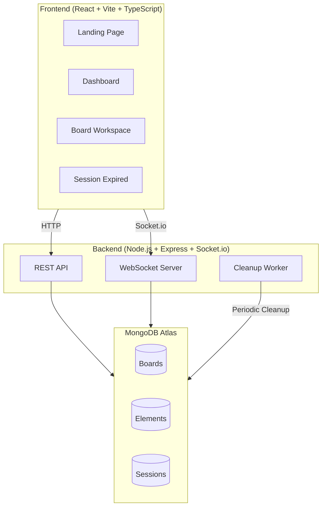

# Collabryx — Implementation Plan

## Overview
Anonymous real-time collaborative whiteboard + structured idea workspace.
Combines Figma (canvas) + Notion (structure) + Miro (multiplayer).

## Architecture

## Phases

### Phase 1 — Foundation Setup ✅
- [x] Initialize Vite + React + TypeScript frontend
- [x] Initialize Express + TypeScript backend
- [x] Configure TailwindCSS v4
- [x] Setup shadcn/ui
- [x] Setup theme engine (light/dark/system)
- [x] Create routing (/, /dashboard, /board/:id, /session-expired)
- [x] Create layout system

### Phase 2 — UI System Build ✅
- [x] Build navbar
- [x] Build landing page sections
- [x] Build dashboard
- [x] Build board card system
- [x] Build empty states
- [x] Build loading skeletons

### Phase 3 — Canvas Engine ✅
- [x] Install Konva.js
- [x] Create stage + layers
- [x] Add drawing tools
- [x] Add text blocks + sticky notes
- [x] Add drag/resize/selection

### Phase 4 — Real-Time Sync ✅
- [x] Setup Socket.io client/server
- [x] Create rooms
- [x] Sync elements, cursors, presence
- [x] Activity feed

### Phase 5 — Temporary Session System ✅
- [x] Track active users + disconnects
- [x] Heartbeat system
- [x] Auto-delete inactive boards
- [x] Invalidate links

### Phase 6 — Export System ✅
- [x] JSON export
- [x] PNG export

### Phase 7 — Premium Polish ✅
- [x] Animations + transitions
- [x] Error handling + reconnect
- [x] Skeletons + toasts
- [x] Performance optimization
